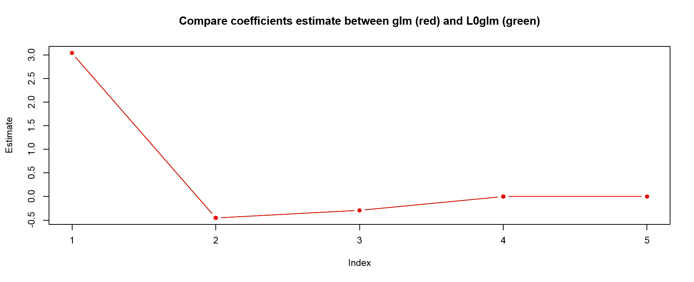
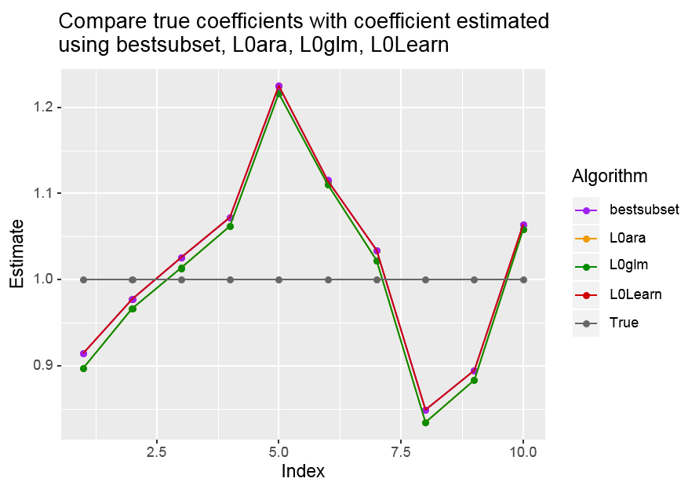
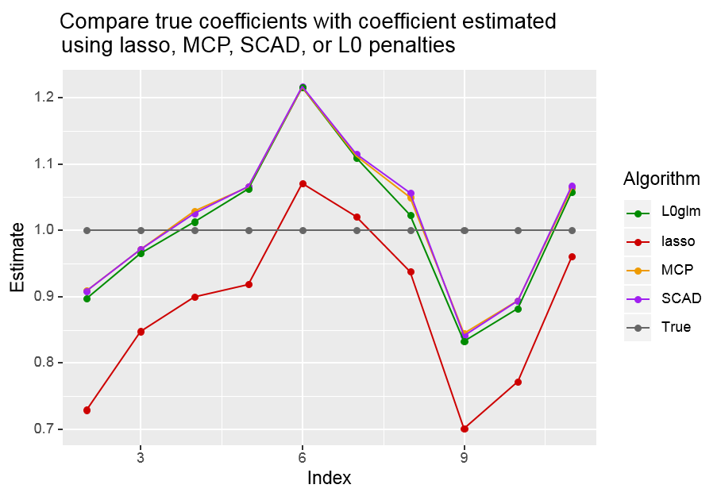

L0glm version 0.1.0.9000
==========================

L0glm is an R package to fit L0 penalized GLMs with nonnegativity constraints on the coefficients. Additionally, the package includes functionality to perform inference on the fitted coefficients. 

Features
--------
* Fit GLM using a wide variety of error structures and link functions.
* Inlcude  L0 penalty as a proxy for best subset selection, allowing for higher number of predictors than observations
* By design, ridge or adaptive ridge penalties are also possible
* Allow for nonnegativity constraints on the coefficients
* Perform inference on the coefficients using the Fischer information matrix (ridge, adaptive ridge, and no penalty) or using non-parametric bootstrapping (L0 penalty and nonnegativity constraint)

Installation
------------

You can report bugs at http://github.com/tomwenseleers/L0glm/issues. 
If you report a bug, try to send a reproducible example and don't forget to send the result of 
```r
sessionInfo()
```

### Github development version
```r
library(devtools)
devtools::install_github("tomwenseleers/L0glm")
```


Getting Started
---------------
```r 
library(L0glm)
```
Simulate some data
```r
sim <- simulate_spike_train()
X <- sim$X
y <- sim$y
```
Set up the parameters for controlling the algorithm
```r
ctrl.fit <- control.fit.gen() # default
ctrl.iwls <- control.iwls.gen(maxit = 1)
ctrl.l0 <- control.l0.gen() # default
```
Fit a GLM with Poisson error structure and identity link, with nonnegativity constraints on the coefficients, and L0 penalty
```r
L0glm.out <- L0glm(X = X, y = y, family = poisson(identity), intercept = FALSE,
                  lambda = 1, tune.meth = "none", nonnegative = TRUE,
                  control.iwls = ctrl.iwls, control.l0 = ctrl.l0,
                  control.fit = ctrl.fit)
```
Perform inference on the coefficients. The function will automatically choose the correct inference procedure (non parametric bootstrapping in this case):
```r
L0glm.infer.out <- L0glm.inference(L0glm.out, level = 0.95, boot.repl = 1000,
                                   control.l0 = ctrl.l0, control.iwls = ctrl.iwls, 
                                   control.fit = ctrl.fit)
```
Plot the results 
```r
plot_L0glm_benchmark(x = sim$x, y = y, fit = L0glm.out, a.true = sim$a,
                     main="Ground truth vs L0 penalized L0glm estimates")
```

`L0glm`: an "all in one" package
--------------------------------


Benchmark with other R packages 
-------------------------------

In this section, we test our package against other popular packages. 
```r
library(microbenchmark)
```

### GLM fitting using `L0glm` and `glm`

The `glm` function from the `stats` package is probably one of the most popular functions to fit a general linear model. It allows a wide variety of error family structure with several link functions. Since the development of `L0glm` was inspired by the implementation of `glm`, `L0glm` is able to fit the same set of families and link functions.

First, we retrieve some data. This is taken from the ```?glm``` examples (Dobson, 1990, Page 93: Randomized Controlled Trial).

```r
counts <- c(18,17,15,20,10,20,25,13,12)
outcome <- gl(3,1,9)
treatment <- gl(3,3)
```
The timing performance of `L0glm` vs `glm` is measured using `microbenchmark`:
```r
microbenchmark(
  # Glm fitting
  "glm" = {
    glm_fit <- glm(counts ~ outcome + treatment, family = poisson())
  },
  # L0glm fitting (using glm settings)
  "L0glm (glm settings)" = {
    L0glm_fit <- L0glm(counts ~ outcome + treatment,
                       family = poisson(),
                       lambda = 0, tune.meth = "none", nonnegative = FALSE,
                       control.iwls = list(maxit = 25, thresh = .Machine$double.eps),
                       control.l0 = list(maxit = 1),
                       control.fit = list(maxit = 1), verbose = FALSE)
  },
  times = 25
)
```
```
## Unit: milliseconds
##                  expr       min        lq      mean    median        uq       max neval cld
##                   glm  2.096008  2.132154  2.335677  2.162945  2.492719  3.393685    25  a 
##  L0glm (glm settings) 13.157501 13.307886 15.652380 15.791233 16.464169 26.750091    25   b
```

Let's compare the coefficient estimates:
```r
df <- data.frame(coef.glm = coef(glm_fit),
                 coef.L0glm = coef(L0glm_fit))
abs(df$coef.glm - df$coef.L0glm)
```
```
## [1] 1.776357e-15 7.216450e-16 0.000000e+00 2.018962e-16 7.049779e-16 
```

<p align="left">
  
</p>

*The red curve is hidden behind the green curve* 


#### Conclusion
Both algorithms give exactly the same solution (up to 2E-15). The higher functionnality of the L0glm framework (possibility of nonnegative constraints and regularization) is at the cost of timing performance. 


### Ridge regression using `L0glm` and `glmnet`

```glmnet``` is a very efficient and popular package for ridge, lasso, and elastic net regression (TODO ref Tibshirani). The algorithm of ```L0glm``` is based on the adaptive ridge procedure (TODO ref Frommmlet), where a ridge regression with prior weights on the penalty is iteratively fit. When we perform a single iteration with constant priors, this boils down to a simple ridge regression.
```r
library(glmnet)
```

Let's simulate some data generated by non zero factors (ridge cannot enforce sparsity) added with Gaussian noise:
```r
set.seed(123)
n <- 100
p <- 20
x <- matrix(rnorm(n*p), nrow = n, ncol = p)
beta <- runif(p)
y0 <- x %*% beta
y <- y0 + rnorm(n, mean = 0, sd = 2.5)
```
We fit the data using `L0glm` and `glmnet` and compare their timing:
```r
microbenchmark(
  # Ridge regression using glmnet
  "glmnet" = {
    glmnet_fit <- glmnet(x = x, y = y, family = "gaussian", alpha = 0,
                         standardize = FALSE, thresh = .Machine$double.eps,
                         lambda = 10^seq(10,0), intercept = FALSE)
    # Note: best lambda was tuned with 3-fold cv on sequence 10^seq(-10, 10)
  },
  # L0glm fitting (using glm settings)
  "L0glm (ridge settings)" = {
    L0glm_fit <- L0glm(y ~ 0 + ., data = data.frame(y = y, x),
                       family = gaussian(),
                       lambda = 10, tune.meth = "none", nonnegative = FALSE,
                       control.iwls = list(maxit = 25, thresh = .Machine$double.eps),
                       control.l0 = list(maxit = 1),
                       control.fit = list(maxit = 1), verbose = FALSE)
    # Note: best lambda was tuned with 3-fold cv on sequence 10^seq(-10, 10)
  },
  times = 25
)
```
```
## Unit: milliseconds
##                    expr     min       lq     mean   median       uq      max neval cld
##                  glmnet 1.60023 1.614064 1.658403 1.627898 1.646640 2.371787    25  a 
##  L0glm (ridge settings) 3.86358 3.924716 4.129006 3.943011 3.981835 5.891759    25   b
```
Note that ridge regression requires a regularization factor `lambda`. The `lambda` value leading the lowest 3-fold CV error was chosen separately for `L0glm` and `glmnet`. Note also that `glmnet` was fit using a decreasing sequence of `lambda`. This is, according to the authors, the more efficient than fitting a single `lambda` since `glmnet` makes use of warm starts between subsequent `lambda` values when computing the regularization path.

Let's compare the results:
```r
df <- data.frame(coef.glmnet = coef(glmnet_fit, s = 1)[-1], # first element is an empty intercept
                 coef.L0glm = coef(L0glm_fit),
                 coef.true = beta)
abs(df$coef.glmnet - df$coef.L0glm)
```
```
##  [1] 0.01445223 0.14228227 0.09717940 0.12926206 0.16251310 0.00505276 0.10352445 0.21663310 0.01424080 0.39396569
## [11] 0.18586970 0.45913658 0.18662384 0.14485096 0.11259742 0.20647775 0.41230362 0.12064256 0.22498617 0.11762545
```

<p align="left">
  
</p>


#### Conclusion

Both algorithms exhibit coefficients following the same trend but the absolute coefficients values are quite different. 


### L0 penalized regression using `L0ara`, `bestsubset`, `L0Learn`, and `L0glm`

The L0 penalty in linear regression is considered as a holy grail in model fitting. 

TODO put formula of L0 penalized regression

Indeed, the concept behind L0 penalty is that variables for which the true coefficients is zero are penalized towards zero (removes false positivity) while variable for which the true coefficient isn't zero are not penalized, and hence unbiased. This boils down to identifying the subset of covariates that are non zero and fit an unpenalized linear regression, and this is also best subset regression. Hence, L0 penalized regression can be a proxy to best subset selection.

In `L0glm` as well as in `L0ara`, the L0 penalty is approximated using an adaptive ridge procedure (TODO ref Frommlet 2016 + Liu 2017). In `L0Learn`, the L0 penalized regression is optimized using a cyclic coordinate descent algorithm (TODO ref Hazimeh). The algorithm in `bestsubset` is based on mixed integer optimization (TODO ref Bertsimas 2016, Hastie 2017).

```r
library(L0Learn)
library(l0ara)
library(bestsubset)
```

Let's simulate some data using the `GenSynthetic` function in the `L0Learn` package:

```r
n <- 200
p <- 500
k <- 10
data <- GenSynthetic(n = n, p = p, k = k, seed = 123)
beta <-  c(rep(1, k), rep(0, p - k))
x <- data$X
y <- data$y
```

We fit the data using `L0glm`, `L0ara`, `L0Learn`, and `bestsubset` and compare their timing:

```r
microbenchmark(
  # L0 penalized regression using L0Learn
  "L0Learn" = {
    L0Learn_fit <- L0Learn.fit(x = x, y = y, penalty="L0", maxSuppSize = ncol(X),
                               nGamma = 0, autoLambda = FALSE, lambdaGrid = list(1.56E-2),
                               tol = 1E-7)
  },
  # L0 penalized regression using L0ara
  "L0ara" = {
    L0ara_fit <- l0ara(x = x, y = y, family = "gaussian", lam = 2.5,
                       standardize = F, eps = 1E-7)
  },
  # Best subset regression using bestsubset
  "bestsubset" = {
    bs_fit <- bs(x = x, y = y, k = k, intercept = TRUE,
                 form = ifelse(nrow(x) < ncol(x), 2, 1), time.limit = 5, nruns = 50,
                 maxiter = 1000, tol = 1e-7, polish = TRUE, verbose = FALSE)
  },
  # L0 penalized regression using L0glm
  "L0glm" = {
    L0glm_fit <- L0glm(y ~ 1 + ., data = data.frame(y = y, x),
                       family = gaussian(),
                       lambda = 2.5, tune.meth = "none", nonnegative = FALSE,
                       control.iwls = list(maxit = 100, thresh = 1E-7),
                       control.l0 = list(maxit = 100, rel.tol = 1E-7),
                       control.fit = list(maxit = 1), verbose = FALSE)
  },
  times = 5
)
```
```
Unit: milliseconds
       expr         min          lq        mean      median         uq         max neval cld
    L0Learn    1.519014    1.618527    1.808269    1.672522    1.88181    2.349474     5 a  
      L0ara   30.923810   35.449169   43.382672   39.948200   48.55491   62.037274     5 a  
 bestsubset 5403.912756 5448.323395 5581.924445 5530.706712 5641.51577 5885.163595     5   c
      L0glm  550.024610  550.614545  563.418621  554.177803  567.09924  595.176907     5  b 
```

Note that `bestsubset` is optimized using the true number of nonzero coefficient because tuning it is very slow. Furthermore, the algorithm checks the solution using the Gurobi's mixed integer program solver which is very slow for k = 10, so time limit was set to `time.limit = 5` (5 sec) which dramatically overestimates the time performance of `bestsubset`.

Here we check the results:

```r
df <- data.frame(coef.L0Learn = as.numeric(L0Learn_fit$beta[[1]]),
                 coef.L0ara = L0ara_fit$beta,
                 coef.bestsubset = as.vector(bs_fit$beta),
                 coef.L0glm = coef(L0glm_fit)[-1],
                 coef.true = beta)
```

```r
all(df[(k+1):p,] == 0)
```
```
[1] TRUE
```
No false positives are reported for any algorithm!

```r
abs(df$coef.L0Learn - df$coef.bestsubset)[1:k]
```
```
[1] 4.895098e-05 5.048775e-05 6.223206e-05 5.445665e-05 2.923354e-04 6.432352e-04 8.146334e-07 1.039894e-04 8.360381e-05 6.299256e-05
```
Differences between the solution computed by `L0Learn` and `bestsubset` are little.

```r
abs(df$coef.L0glm - df$coef.L0ara)[1:k]
```
```
 [1] 1.158675e-08 1.239927e-08 3.023772e-09 1.710095e-08 9.935052e-09 1.024232e-08 1.100019e-08 6.542200e-10 9.247086e-09 1.024373e-09
```
Solution computed with `L0glm` and `L0ara` are almost identical (up to 2E-8).

```r
abs(df$coef.L0glm - df$coef.L0Learn)[1:k]
```
```
 [1] 0.017378233 0.011048311 0.012139064 0.010338355 0.008954877 0.004407962 0.012004346 0.014808499 0.011377584 0.005616895
```
There is a noticeable difference between `L0glm` and `L0Learn`. However, the coefficients seem to be scaled with respect to one another. This is easier to see in this plot:

<p align="left">
  
</p>

*Note that the curve for `L0ara` is hidden behind `L0Learn` and the curve for `bestsubset` is hidden behind `L0Learn`.*

#### Conclusion

All 4 algorithms are able to correctly identify the set of non-zero coefficients. The algorithms based on the adaptive ridge (`L0glm` and `L0ara`) are slightly biased with respect to the CD algorithm (`L0Learn`) or the MIO algorithm (`bestsubset`).

With respect to timing, `L0Learn` is the fastest algorithm and, unfortunately, our `L0glm` algorithm is approximately 250x slower. However, `L0Learn` is able to solve problems containing Gaussian noise whereas our algorithm is able to solve L0 penalized regression for a wide variety of error structures and can also account for nonnegativity constraints.


### Compare Lasso, MCP, SCAD, and L0 penalties


Other popular approximations for best subset selection are the lasso (L1 norm), MCP and SCAD penalties.

TODO give definition of the penalties

The `ncvreg` package implements the lasso, MCP and SCAD penalties and allow us to test whether L0 penalty as a proxy for best subset selection is indeed the best penalty for regression. 

```r
library(ncvreg)
```

Again, we start with simulating data with sparse coefficients using the `GenSynthetic` function in the `L0Learn` package:
```r
n <- 200
p <- 500
k <- 10
data <- GenSynthetic(n = n, p = p, k = k, seed = 123)
beta <-  c(rep(1, k), rep(0, p - k))
x <- data$X
y <- data$y
```

We fit the data with the different penalities and measure the time performance. Note that we use our `L0glm` package to fit the L0 penalty. All `lambda`'s have been previously tuned using 3-fold cross-validation on a suitable range.
```r
microbenchmark(
  "lasso" = {
    lasso_fit <- ncvreg(X = x, y = y, family = "gaussian", penalty = "lasso",
                        alpha = 1, lambda = 0.1278381, eps = 1e-7)
  },
  "MCP" = {
    mcp_fit <- ncvreg(X = x, y = y, family = "gaussian", penalty = "MCP",
                        alpha = 1, lambda = 0.1678555, eps = 1e-7)
  },
  "SCAD" = {
    scad_fit <- ncvreg(X = x, y = y, family = "gaussian", penalty = "SCAD",
                        alpha = 1, lambda = 0.1442869, eps = 1e-7)
  },
  "L0" = {
    L0glm_fit <- L0glm(y ~ 1 + ., data = data.frame(y = y, x),
                       family = gaussian(),
                       lambda = 2.5, tune.meth = "none", nonnegative = FALSE,
                       control.iwls = list(maxit = 100, thresh = 1E-4),
                       control.l0 = list(maxit = 100, rel.tol = 1E-7, warn = TRUE),
                       control.fit = list(maxit = 1), verbose = FALSE)
  },
  times = 5
)
```
```
Unit: milliseconds
  expr        min         lq       mean     median         uq        max neval cld
 lasso   4.149622   4.203617   7.075197   4.723492   4.825236  17.474019     5  a 
   MCP   4.051449   4.068852   4.646738   4.329904   4.444589   6.338894     5  a 
  SCAD   4.166134   4.204957   4.286173   4.238871   4.275463   4.545440     5  a 
    L0 502.345681 520.728253 545.483454 538.695371 568.632535 597.015431     5   b
```

Although all penalties encourage sparsity in the fitted coefficients, let's check the sensitivity and specificity of the algorithms:

```r
df <- data.frame(coef.lasso = coef(lasso_fit)[-1], # remove intercept
                 coef.mcp = coef(mcp_fit)[-1],
                 coef.scad = coef(scad_fit)[-1],
                 coef.L0 = coef(L0glm_fit)[-1],
                 coef.true = beta)
FP <- colSums(df[(k+1):p,] != 0)
TP <- colSums(df[1:k,] != 0)
FN <- colSums(df[1:k,] == 0)
TN <- colSums(df[(k+1):p,] == 0)
```
#### Sensitivity
```r
TP/(TP + FN)
```
```
coef.lasso   coef.mcp  coef.scad    coef.L0  coef.true 
         1          1          1          1          1 
```
All penalties allow for non-zero coefficients to be be estimated as such.

#### Specificity
```r
TN/(TN + FP)
```
```
coef.lasso   coef.mcp  coef.scad    coef.L0  coef.true 
 0.9428571  0.9897959  0.9693878  1.0000000  1.0000000 
```
Only the L0 penalty is able to remove variables that are zero in the true model.

When looking at the estimates, it can be seen that the SCAD, MCP and L0 penalties lead to similar results. The slight shift observed for the L0 penalty is linked to the fact that it is fit with our `L0glm` algorithm and fitting the L0 penalized, fitting the L0 penalized with `L0Learn` decreases the gap. However, there is an important difference when fitting the regression using the lasso penalty. Possible reasons are that this gap is compensated by the observed higher false negativity (lower specificity) and that introducing this penalty leads to the well known bias-variance trade-off.

<p align="left">
  
</p>

#### Conclusion

The L0 penalty seems indeed to have better feature selection properties than the MCP, SCAD, or lasso penalties, at least in the n >> p case. Again, `L0glm` is slower than `ncvreg`, but this is linked to the optimization algorithm rather than the penalty since `L0Learn` is faster than `ncvreg`.

Application example
-------------------

Show L0glm application for GC-MS mass calibration ?

License
-------
The L0glm package is licensed under the GPLv2.


