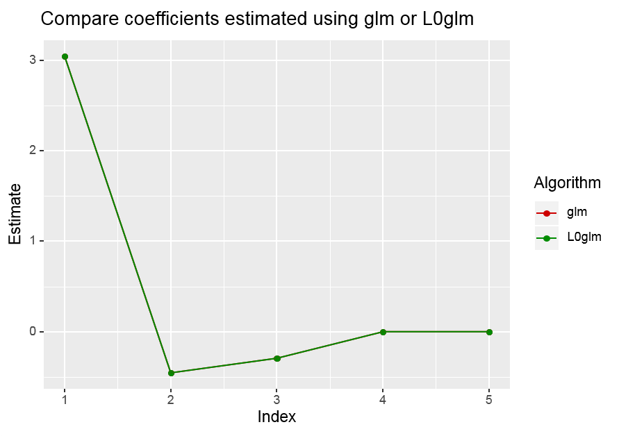
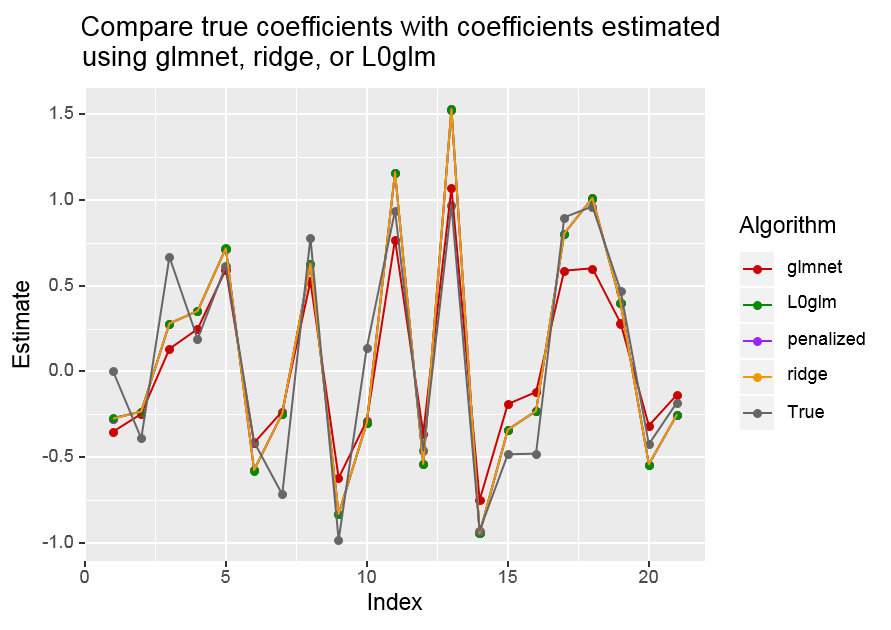

L0glm version 0.1.0.9000
==========================

L0glm is an R package to fit L0 penalized GLMs with nonnegativity constraints on the coefficients. Additionally, the package includes functionality to perform inference on the fitted coefficients. 

Features
--------
* Fit GLM using a wide variety of error structures and link functions.
* Inlcude  L0 penalty as a proxy for best subset selection, allowing for higher number of predictors than observations
* By design, ridge or adaptive ridge penalties are also possible
* Allow for nonnegativity constraints on the coefficients
* Perform inference on the coefficients using the Fischer information matrix (ridge, adaptive ridge, and no penalty) or using non-parametric bootstrapping (L0 penalty and nonnegativity constraint)

Installation
------------

You can report bugs at http://github.com/tomwenseleers/L0glm/issues. 
If you report a bug, try to send a reproducible example and don't forget to send the result of 
```r
sessionInfo()
```

### Github development version
```r
library(devtools)
devtools::install_github("tomwenseleers/L0glm")
```


Getting Started
---------------
```r 
library(L0glm)
```
Simulate some data
```r
sim <- simulate_spike_train()
X <- sim$X
y <- sim$y
```
Set up the parameters for controlling the algorithm
```r
ctrl.fit <- control.fit.gen() # default
ctrl.iwls <- control.iwls.gen(maxit = 1)
ctrl.l0 <- control.l0.gen() # default
```
Fit a GLM with Poisson error structure and identity link, with nonnegativity constraints on the coefficients, and L0 penalty
```r
L0glm.out <- L0glm(X = X, y = y, family = poisson(identity), intercept = FALSE,
                  lambda = 1, tune.meth = "none", nonnegative = TRUE,
                  control.iwls = ctrl.iwls, control.l0 = ctrl.l0,
                  control.fit = ctrl.fit)
```
Perform inference on the coefficients. The function will automatically choose the correct inference procedure (non parametric bootstrapping in this case):
```r
L0glm.infer.out <- L0glm.inference(L0glm.out, level = 0.95, boot.repl = 1000,
                                   control.l0 = ctrl.l0, control.iwls = ctrl.iwls, 
                                   control.fit = ctrl.fit)
```
Plot the results 
```r
plot_L0glm_benchmark(x = sim$x, y = y, fit = L0glm.out, a.true = sim$a,
                     main="Ground truth vs L0 penalized L0glm estimates")
```

Benchmark with other R packages 
-------------------------------

In this section, we test our package against other popular packages. 
```r
library(microbenchmark)
```

### GLM fitting using `L0glm` and `glm`

The `glm` function from the `stats` package is probably one of the most popular functions to fit a general linear model. It allows a wide variety of error family structure with several link functions. Since the development of `L0glm` was inspired by the implementation of `glm`, `L0glm` is able to fit the same set of families and link functions.

First, we retrieve some data. This is taken from the ```?glm``` examples (Dobson, 1990, Page 93: Randomized Controlled Trial).

```r
counts <- c(18,17,15,20,10,20,25,13,12)
outcome <- gl(3,1,9)
treatment <- gl(3,3)
```
The timing performance of `L0glm` vs `glm` is measured using `microbenchmark`:
```r
microbenchmark(
  # Glm fitting
  "glm" = {
    glm_fit <- glm(counts ~ outcome + treatment, family = poisson())
  },
  # L0glm fitting (using glm settings)
  "L0glm (glm settings)" = {
    L0glm_fit <- L0glm(counts ~ outcome + treatment,
                       family = poisson(),
                       lambda = 0, tune.meth = "none", nonnegative = FALSE,
                       control.iwls = list(maxit = 25, thresh = .Machine$double.eps),
                       control.l0 = list(maxit = 1),
                       control.fit = list(maxit = 1), verbose = FALSE)
  },
  times = 25
)
```
```
## Unit: milliseconds
##                  expr       min        lq      mean    median        uq       max neval cld
##                   glm  2.096008  2.132154  2.335677  2.162945  2.492719  3.393685    25  a 
##  L0glm (glm settings) 13.157501 13.307886 15.652380 15.791233 16.464169 26.750091    25   b
```

Let's compare the coefficient estimates:
```r
df <- data.frame(coef.glm = coef(glm_fit),
                 coef.L0glm = coef(L0glm_fit))
abs(df$coef.glm - df$coef.L0glm)
```
```
## [1] 1.776357e-15 7.216450e-16 0.000000e+00 2.018962e-16 7.049779e-16 
```

```r
plot(df$coef.L0glm, col = "green4", pch = 16, type = "b", ylab = "Estimate",
     main = "Compare coefficients estimate between glm (red) and L0glm (green)")
points(df$coef.glm, col = "red2", pch = 16, type = "b")
```
<!-- -->


#### Conclusion
Both algorithms give almost exactly the same solution (up to 2E-15). The higher functionnality of the L0glm framework (possibility of nonnegative constraints and regularization) is a the cost of timing performance.


### Ridge regression using `L0glm` and `glmnet`

```glmnet``` is a very efficient and popular package for ridge, lasso, and elastic net regression (TODO ref Tibshirani). The algorithm of ```L0glm``` is based on the adaptive ridge procedure (TODO ref Frommmlet), where a ridge regression with prior weights on the penalty is iteratively fit. When we perform a single iteration with constant priors, this boils down to a simple ridge regression.

Let's simulate some data generated by non zero factors (ridge cannot enforce sparsity) added with Gaussian noise:
```r
set.seed(123)
n <- 100
p <- 20
x <- matrix(rnorm(n*p), nrow = n, ncol = p)
beta <- runif(p)
y0 <- x %*% beta
y <- y0 + rnorm(n, mean = 0, sd = 2.5)
```
We fit the data using `L0glm` and `glmnet` and compare their timing:
```r
microbenchmark(
  # Ridge regression using glmnet
  "glmnet" = {
    glmnet_fit <- glmnet(x = x, y = y, family = "gaussian", alpha = 0,
                         standardize = FALSE, thresh = .Machine$double.eps,
                         lambda = 10^seq(10,0), intercept = FALSE)
    # Note: best lambda was tuned with 3-fold cv on sequence 10^seq(-10, 10)
  },
  # L0glm fitting (using glm settings)
  "L0glm (ridge settings)" = {
    L0glm_fit <- L0glm(y ~ 0 + ., data = data.frame(y = y, x),
                       family = gaussian(),
                       lambda = 10, tune.meth = "none", nonnegative = FALSE,
                       control.iwls = list(maxit = 25, thresh = .Machine$double.eps),
                       control.l0 = list(maxit = 1),
                       control.fit = list(maxit = 1), verbose = FALSE)
    # Note: best lambda was tuned with 3-fold cv on sequence 10^seq(-10, 10)
  },
  times = 25
)
```
```
## Unit: milliseconds
##                    expr     min       lq     mean   median       uq      max neval cld
##                  glmnet 1.60023 1.614064 1.658403 1.627898 1.646640 2.371787    25  a 
##  L0glm (ridge settings) 3.86358 3.924716 4.129006 3.943011 3.981835 5.891759    25   b
```
Note that ridge regression requires a regularization factor `lambda`. The `lambda` value leading the lowest 3-fold CV error was chosen separately for `L0glm` and `glmnet`. Note also that `glmnet` was fit using a decreasing sequence of `lambda`. This is, according to the authors, the more efficient than fitting a single `lambda` since `glmnet` makes use of warm starts between subsequent `lambda` values when computing the regularization path.

Let's compare the results:
```r
df <- data.frame(coef.glmnet = coef(glmnet_fit, s = 1)[-1], # first element is an empty intercept
                 coef.L0glm = coef(L0glm_fit),
                 coef.true = beta)
abs(df$coef.glmnet - df$coef.L0glm)
```
```
##  [1] 0.01445223 0.14228227 0.09717940 0.12926206 0.16251310 0.00505276 0.10352445 0.21663310 0.01424080 0.39396569
## [11] 0.18586970 0.45913658 0.18662384 0.14485096 0.11259742 0.20647775 0.41230362 0.12064256 0.22498617 0.11762545
```
```r
plot(df$coef.true, pch = 16, type = "b", ylab = "Estimate",
     main = "Compare true coefficients (black) with estimate fitted with glmnet (red) or L0glm (green)")
points(df$coef.L0glm, col = "green4", pch = 16, type = "b")
points(df$coef.glmnet, col = "red2", pch = 16, type = "b")
```

<!-- -->


### Compare L0glm with Lasso, MC+, SCAD

### Compare with L0ara, bestsubset, L0Learn

Application example
-------------------

Show L0glm application for GC-MS mass calibration ?

License
-------
The L0glm package is licensed under the GPLv2.


